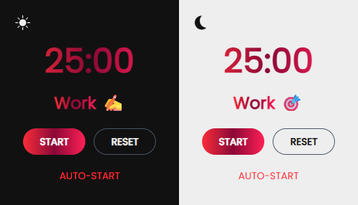

# Pomodoro Chrome Extension

A simple Pomodoro timer extension for Chrome. Helps you stay focused by breaking work into 25-minute sessions followed by short breaks.


## Screenshots




## Tech Stack

**Front-End:** React, TailwindCSS

**Chrome Extension APIs:** Storage, Offscreen, Action, Background (Service Worker – Manifest V3)

**Build Tools:** Vite, npm

**Version Control & Hosting:** Git, GitHub


## Features

- 25-minute work sessions, 5-minute short breaks, and 15-minute long breaks

- Notifications when sessions end

- Simple UI with Start, Auto-Start and Reset

- Persistent timer state and settings using local storage

- Long breaks triggered after 4 completed pomodoros

## Run Locally

Clone the project

```bash
  git clone https://github.com/leakoo/pomodoro-chrome-extension
```

Go to the project directory

```bash
  cd pomodoro-chrome-extension
```

Install dependencies

```bash
  npm install
```

Start the server

```bash
  npm run build
```

Once you have done these then go to `chrome://extensions/`, Press load unpacked and then select the dist folder inside the project directory.


## License

[MIT](https://choosealicense.com/licenses/mit/)